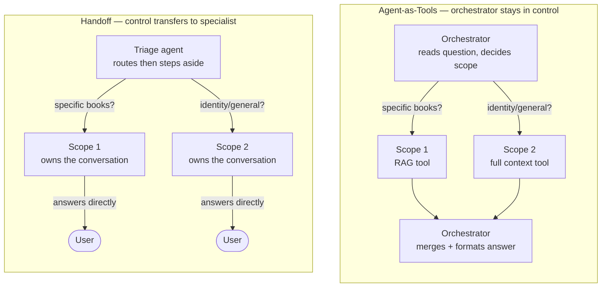
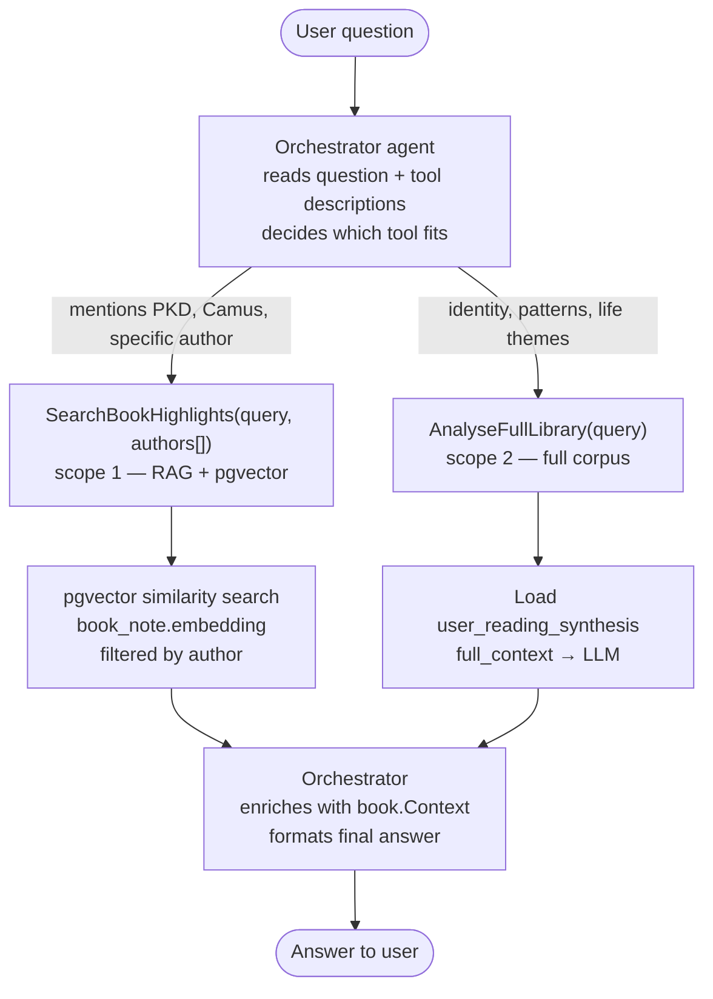
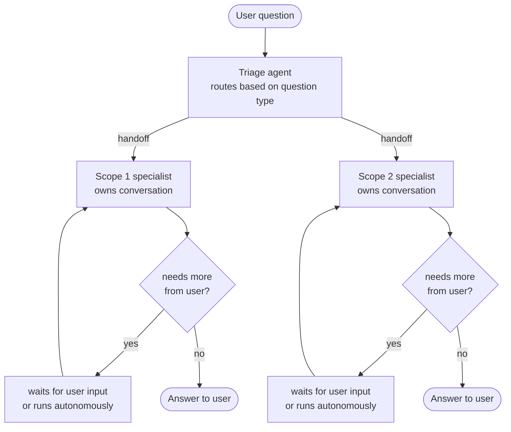
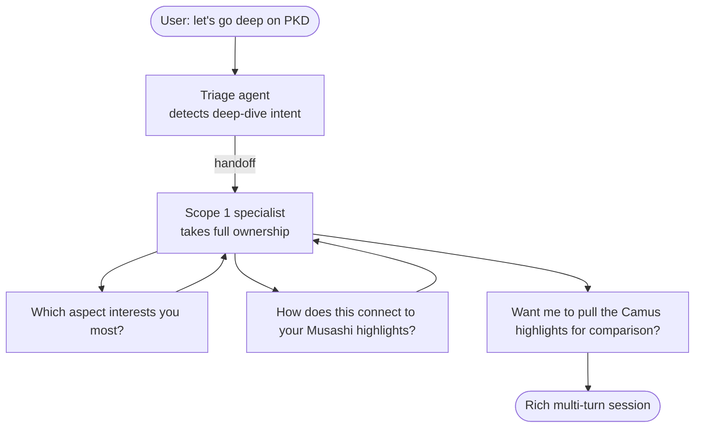
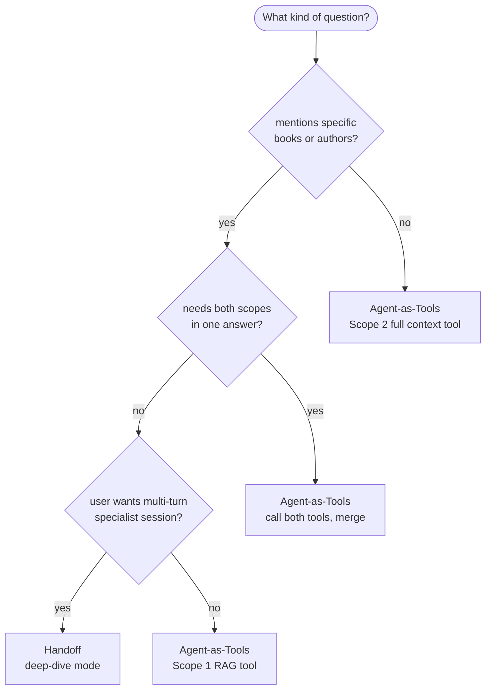

The [Microsoft Agent Framework](https://learn.microsoft.com/en-us/agent-framework/workflows/orchestrations/) gives you five ways to wire agents together. Sequential runs agents one after another in a fixed pipeline. Concurrent runs them in parallel. Group Chat lets agents collaborate in a shared conversation. Magentic drops a manager agent in charge of dynamically coordinating the others. All four are worth their own posts.
The two that trip people up are agent-as-tools and handoff. They both have a routing agent. They both have specialists. At first glance they look like the same thing with different names.
The difference is in who stays in control after the routing decision. And if you pick the wrong one, you'll feel it.

## The project

I'm building a reading assistant on top of my Kindle highlights. I read a lot — Philip K. Dick, Asimov, Murakami, Camus, Julian Assange, Musashi — and my highlights jump across science fiction, philosophy, economics, and martial arts. The agent needs to answer questions about all of that.

It has two modes:

- **Scope 1 — RAG:** search my highlights using pgvector similarity on `book_note.embedding`, enriched with `book.Context` (an LLM-generated thematic background I store per book in the database)
- **Scope 2 — Full context:** load my entire reading library from `user_reading_synthesis` — a pre-built table with all highlights concatenated — and let the model reason across everything at once

Some questions are clearly Scope 1:

- *"What do my Philip K. Dick notes have in common?"*
- *"Compare my Japanese author highlights with PKD"*

Some are clearly Scope 2:

- *"What is my core search in life based on my notes?"*
- *"What is my primary reading genre?"*

And some are both at the same time — *"What is my favourite theme in PKD, and does it connect to my general reading identity?"* That last one is where the orchestration choice actually matters.

## The core difference

With **agent-as-tools**, the orchestrator calls each scope as a function tool, gets the results back, and writes the final answer. It never gives up control.

With **handoff**, the triage agent routes to a specialist — and then it's done. The specialist owns the conversation from that point and answers directly to the user. The triage agent is gone.

## How the routing actually works in agent-as-tools

There's no IF/ELSE block anywhere. The orchestrator has two tools registered with descriptions, and the LLM reads those descriptions to decide which one fits the question. That's the whole classifier.

The system prompt just says *"always call exactly one tool, never answer directly"*. Author names get extracted automatically from the question and passed as parameters to the RAG tool, which uses them as SQL filters on the pgvector search. No parsing, no regex.

And when a question needs both scopes, the orchestrator calls both tools and merges the result. The user sees one answer.

## How handoff flows

After the handoff the triage agent is completely out. The specialist can ask the user follow-up questions, keep the conversation going across multiple turns, and build on what was said before. That loop is the whole point of handoff. It's also why it's the wrong pattern here.

## Why agent-as-tools wins for this

**The orchestrator needs to do something after retrieval.**
When Scope 1 comes back with the top highlights, I still need to inject `book.Context` as thematic background before writing the final answer. With handoff the specialist already answered — the orchestrator is gone and can't touch it.

**Some questions need both scopes.**
That PKD + reading identity question from earlier? Agent-as-tools calls both tools and merges. Handoff forces you to pick one.

**The scope agents have nothing to ask the user.**
Handoff is interactive by design. When a handoff agent doesn't route further, it [blocks and waits for user input](https://learn.microsoft.com/en-us/agent-framework/workflows/orchestrations/handoff). My scope agents just retrieve and return — there's no back-and-forth. I'd have to add `with_autonomous_mode()` as a workaround, which adds complexity for no reason.

## The one case where handoff wins

If I ever add a **deep-dive mode** — user says *"let's spend this session going deep on PKD only"* — then handoff makes sense. The Scope 1 agent takes full control, asks clarifying questions, builds on previous answers across multiple turns.

That's what handoff is built for. I could add it later as an optional mode without touching the core architecture.

## Quick decision guide

## Project Code 

Take a look on the original code and the final decision on the github page [BookNotesAI](https://github.com/FabioRNobrega/book-notes-ia).

## References

- [Workflow orchestrations — Microsoft Agent Framework](https://learn.microsoft.com/en-us/agent-framework/workflows/orchestrations/)
- [Handoff orchestration (C#)](https://learn.microsoft.com/en-us/agent-framework/workflows/orchestrations/handoff?pivots=programming-language-csharp)
- [Sequential orchestration (C#)](https://learn.microsoft.com/en-us/agent-framework/workflows/orchestrations/sequential?pivots=programming-language-csharp)
- [RAG with Microsoft Agent Framework](https://learn.microsoft.com/pt-pt/agent-framework/agents/rag?pivots=programming-language-csharp)
- [pgvector — vector similarity for Postgres](https://github.com/pgvector/pgvector)
- [Microsoft.Extensions.AI — AIFunctionFactory](https://learn.microsoft.com/en-us/dotnet/api/microsoft.extensions.ai.aifunctionfactory)